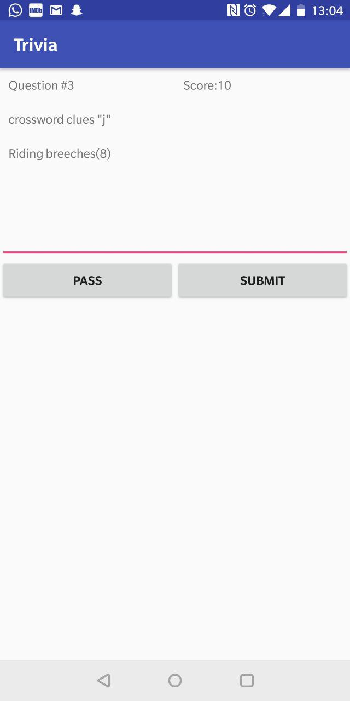
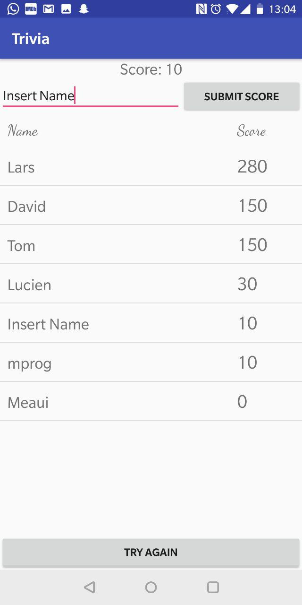

# AppStudio

## Unit 6: Trivia

### Short Description App

In the following app it is possible to answer questions in a jeopardy kinda style. You can see the category and the question. A good answer results in 10 points. Bonus points can be earned if a serie of questions is answered correctly. When the quiz is done a list of highscores is shown. Your score can also be added to the list. 

### Screenshot App 
 
